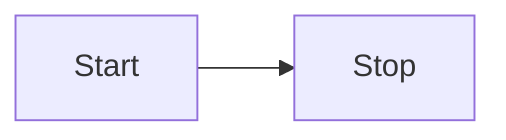

# remark-mermaid

[](https://npmjs.org/packages/remark-mermaid/)
[](https://travis-ci.org/temando/remark-mermaid)
[](https://en.wikipedia.org/wiki/MIT_License)

Replaces graphs defined in [`mermaid`](https://mermaidjs.github.io/) with rendered SVGs.

You might also like [`remark-graphviz`](https://www.npmjs.com/package/remark-graphviz).

## Installation

```sh
$ npm install remark-mermaid mermaid.cli
```

## Usage

Graphs defined using `mermaid` can be referenced using a `mermaid:` title which
will generate an SVG image.

```md
[Link to a Graph](test/fixtures/assets/example.mmd "mermaid:")

```

Alternatively, graphs can be generated inline, by using `mermaid` as the
language identifier for a fenced code block.

<pre>

</pre>

See this project's [fixtures](test/fixtures) for more examples.

### Options

- `simple`: A boolean option which determines whether the plugin will generate SVG, or simply wrap your Mermaid graph in an `<div class="mermaid">` element which [mermaidjs][mermaidjs] can understand.

## Example

### SVG Generation

Given a file, `example.md`, which contains the following Markdown:

<pre>
# mermaid code block


</pre>

Using remark like follows:

```js
var vfile = require('to-vfile');
var remark = require('remark');
var mermaid = require('remark-mermaid');

var example = vfile.readSync('example.md');

remark()
  .use(mermaid)
  .process(example, function (err, file) {
    if (err) throw err;
    console.log(String(file));
  });
```

Will result in an SVG being written relative to `example.md`, and the Markdown
being transformed to:

```md
# mermaid code block


```

To change where the SVG's are written, set `data.destinationDir` on the vFile:

```js
var vfile = require('to-vfile');
var remark = require('remark');
var mermaid = require('remark-mermaid');

var example = vfile.readSync('example.md');
example.data = {
  destinationDir: '~/absolute/path/to/output'
};

remark()
  .use(mermaid)
  .process(example, function (err, file) {
    if (err) throw err;
    vfile.writeSync({ path: example.destinationFilePath });
  });
```

This allows you process files from one directory, and save the results to another.

### Simple mode

If the plugin is enabling graphs to be processed by [mermaidjs][mermaidjs],
enable `simple` mode like follows:

```js
var vfile = require('to-vfile');
var remark = require('remark');
var mermaid = require('remark-mermaid');

var example = vfile.readSync('example.md');

remark()
  .use(mermaid, { simple: true })
  .process(example, function (err, file) {
    if (err) throw err;
    console.log(String(file));
  });
```

This will result in the following Markdown output:

```md
# mermaid code block

<div class="mermaid">
  graph LR
    Start --> Stop
</div>
```

[mermaidjs](https://mermaidjs.github.io/usage.html)
